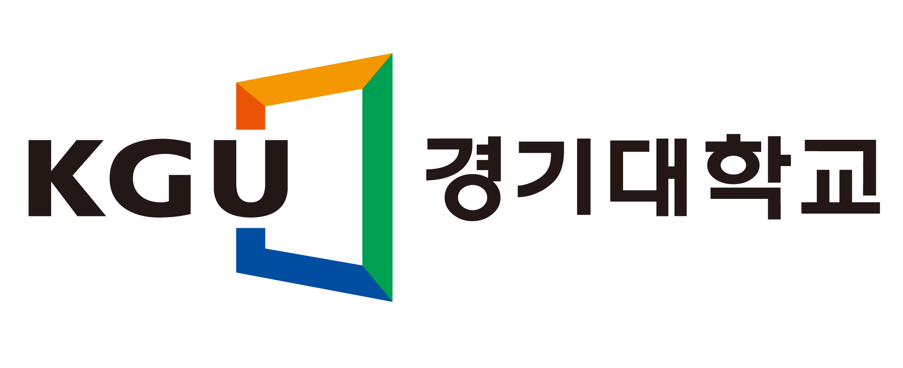

# KGU_open_sw_2

  
  
&nbsp;

  

    <b>OpenMMLab website</b>
    
      <a href="https://openmmlab.com">
        <i>HOT</i>
      </a>
    
    &nbsp;&nbsp;&nbsp;&nbsp;
    <b>OpenMMLab platform</b>
    
      <a href="https://platform.openmmlab.com">
        <i>TRY IT OUT</i>
      </a>
    
  

  
&nbsp;

## 경기대학교 Open Source Software 실습(DD847_2148) 2조 기말과제  🙍‍♂️16학번 임정규(조장) 🙍‍♂️18학번 김성환, 🙍‍♂️18학번 유준혁

# 버전별 추가 사항
- ver 1.0.1 - mmdetection 환경 및 MASK-RCNN Config 라이브러리 다운로드

- ver 1.0.2 - CPU, GPU, Colab(GPU) demo를 통해 구동 확인

- ver 1.0.3 - MASK-RCNN Config 에서 훈련모델 사용할 것 및 _Base_ 에폭 조절 업뎃 (예정)

- ver 1.1.0 - CPU, GPU, Colab(GPU) 훈련 소스 구현 (예정)

- ver 1.1.1 - CPU, GPU, Colab(GPU) 가중치 검증 소스 구현 (예정)

- ver 1.1.2 - CPU, GPU, Colab(GPU) 훈련 결과 가중치 및 로그 공유 (예정)