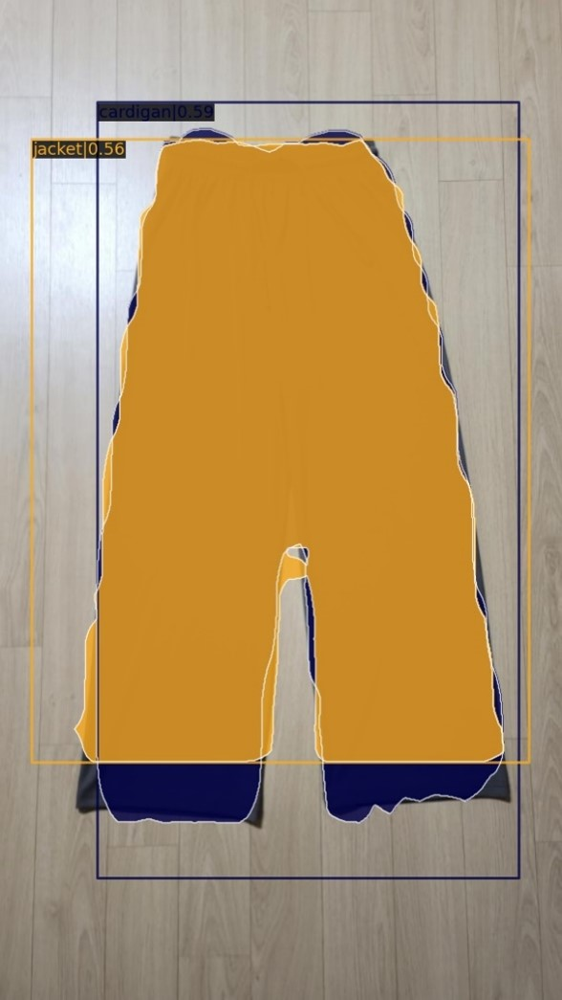
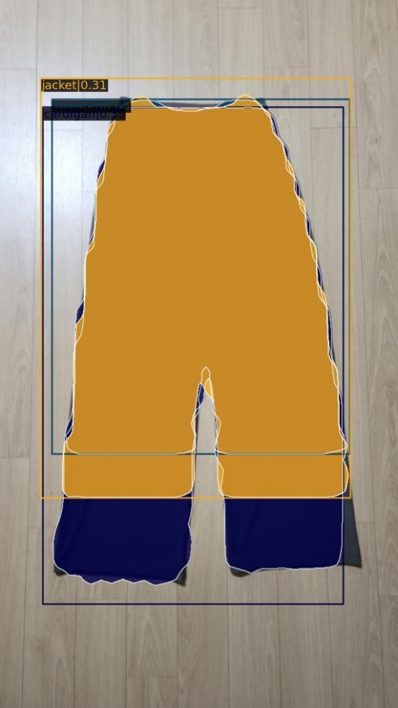
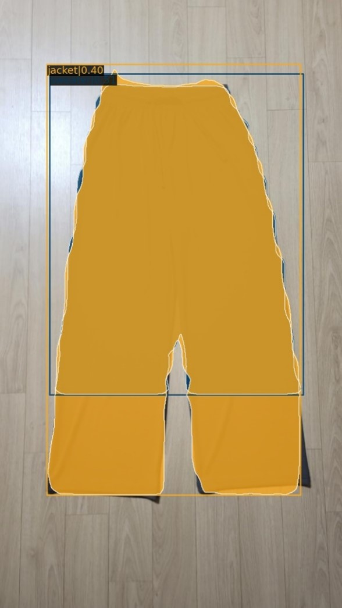
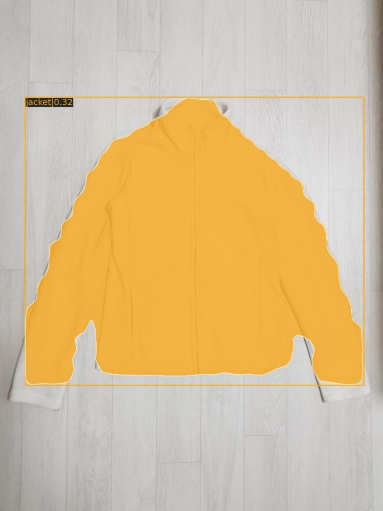
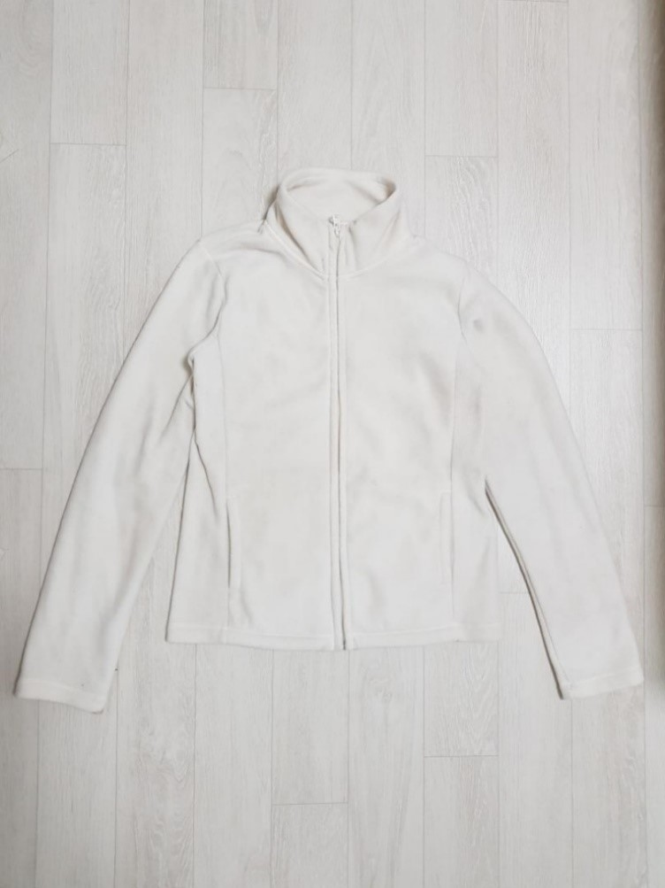
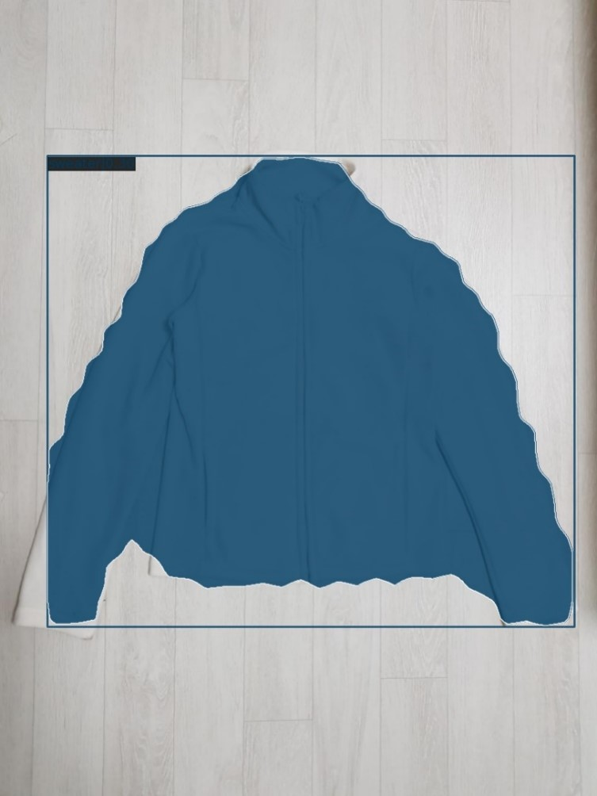
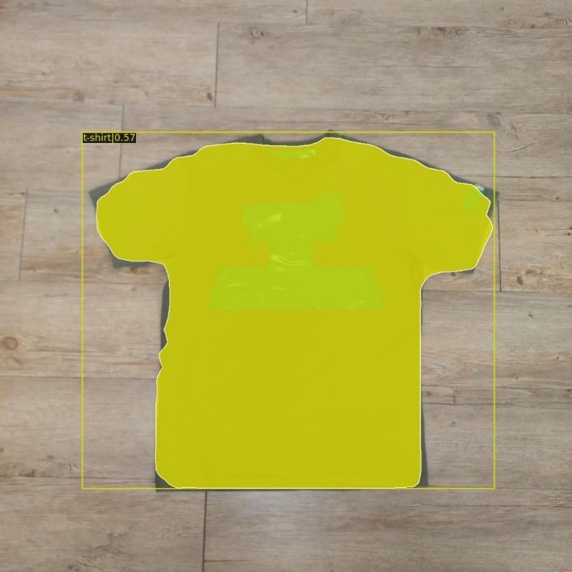
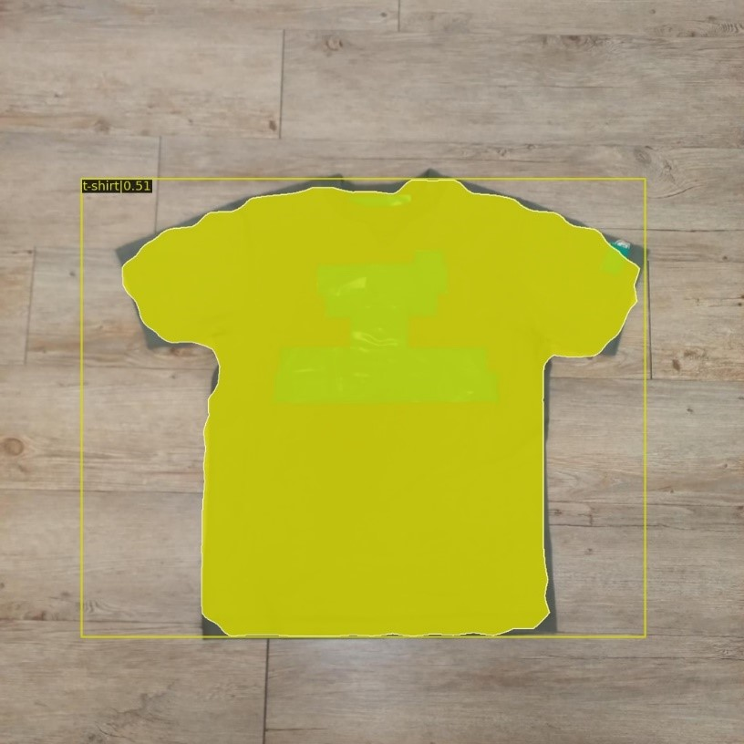
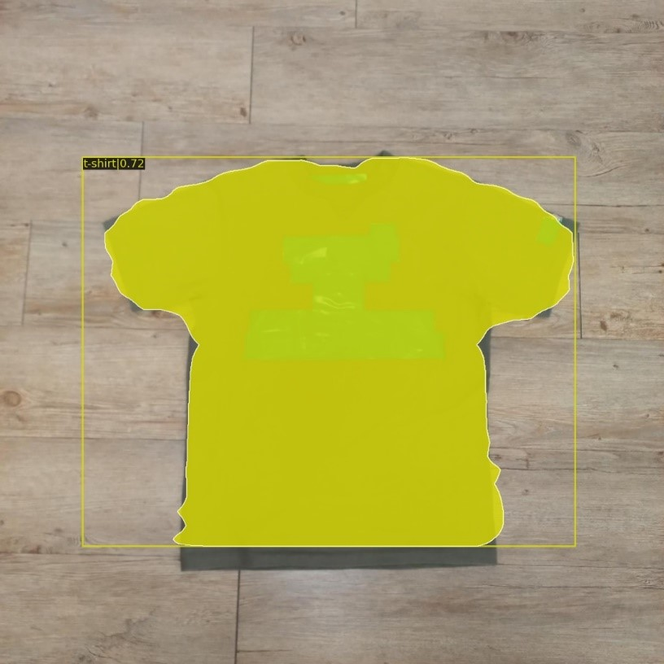

# KGU_open_sw_2

  
  
&nbsp;

  

    <b>OpenMMLab website</b>
    
      <a href="https://openmmlab.com">
        <i>HOT</i>
      </a>
    
    &nbsp;&nbsp;&nbsp;&nbsp;
    <b>OpenMMLab platform</b>
    
      <a href="https://platform.openmmlab.com">
        <i>TRY IT OUT</i>
      </a>
    
  

  
&nbsp;

## 경기대학교 Open Source Software 실습(DD847_2148) 2조 기말과제  🙍‍♂️16학번 임정규(조장) 🙍‍♂️18학번 김성환 🙍‍♂️18학번 유준혁

 

# 버전별 추가 사항
- ver 1.0.1 - mmdetection 환경 및 MASK-RCNN Config 라이브러리 다운로드

- ver 1.0.2 - CPU, GPU, Colab(GPU) demo를 통해 구동 확인

- ver 1.0.3 - MASK-RCNN Config 에서 훈련모델 사용할 것 및 _Base_ 에폭 조절 업뎃

- ver 1.1.0 - CPU, GPU, Colab(GPU) 훈련 / 검증 소스 구현

# 훈련 환경과 폴더 수정
<figure class="half">
    
    
</figure>
 
anaconda와 colab으로 기말과제를 수행하였음
  
본래 mmdetection내의 있는 파일과 폴더를 대부분 가져왔으나 Docker 폴더를 제외시켰고 mmdetection내의 사용하지 않는 구조는 제외하였음
  

# MASK-RCNN 학습 데이터 조절
주어진 실습 데이터중 훈련을 제대로 하기 위해 Train, Validation, Test 데이터의 비중을 중복되지 않게 8:1:1로 나누어 분배하였음
  
(총 5926개의 data이기에 Train-4765, Val-577, Test-584로 분배함)
  
실습데이터는 이러한 비율로 데이터가 나뉘어져 있는 것이 아닌 카테고리 별로 데이터가 나누어져있어 이를 각 카테고리마다 Train-Val-Test를 분리할 필요가 있으니 이를 주피터 노트북을 활용하여 카테고리별로 분류되어있는 이미지를 취합함
  
마찬가지로 나뉘어져있는 json도 분류하여 Train-Val-Test 별로 취합함

# 학습결과

## pants

  <figure class="third">
      
      
      
  </figure>

## jumper

  <figure class="third">
      
      
      
  </figure>

## t-shirt

  <figure class="third">
      
      
      
  </figure>

